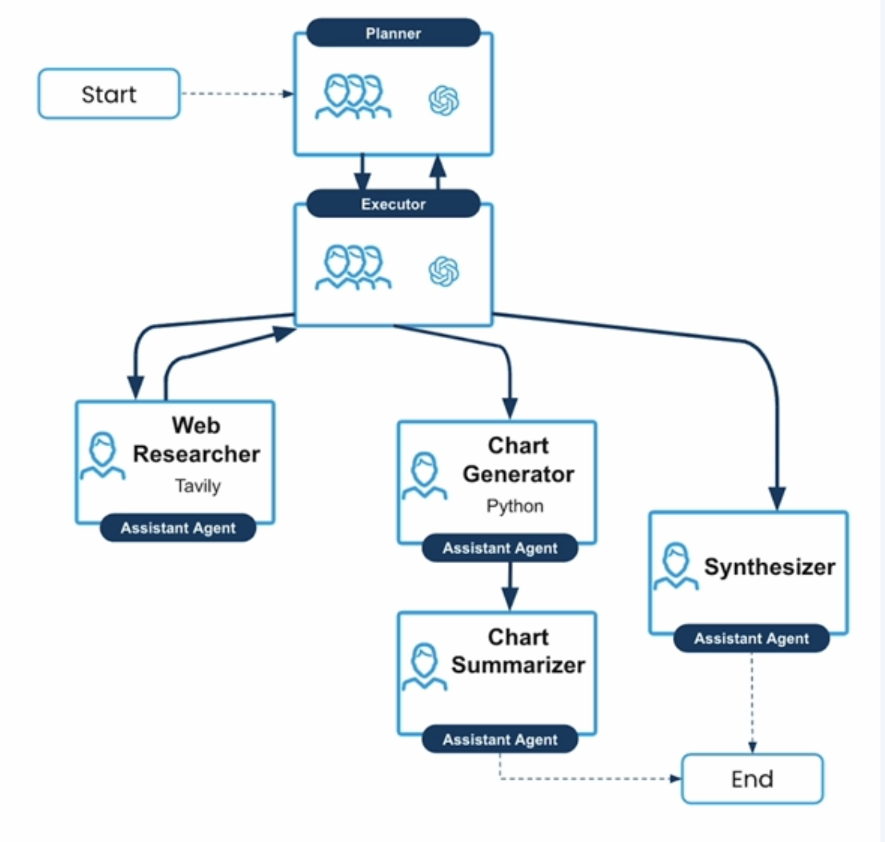
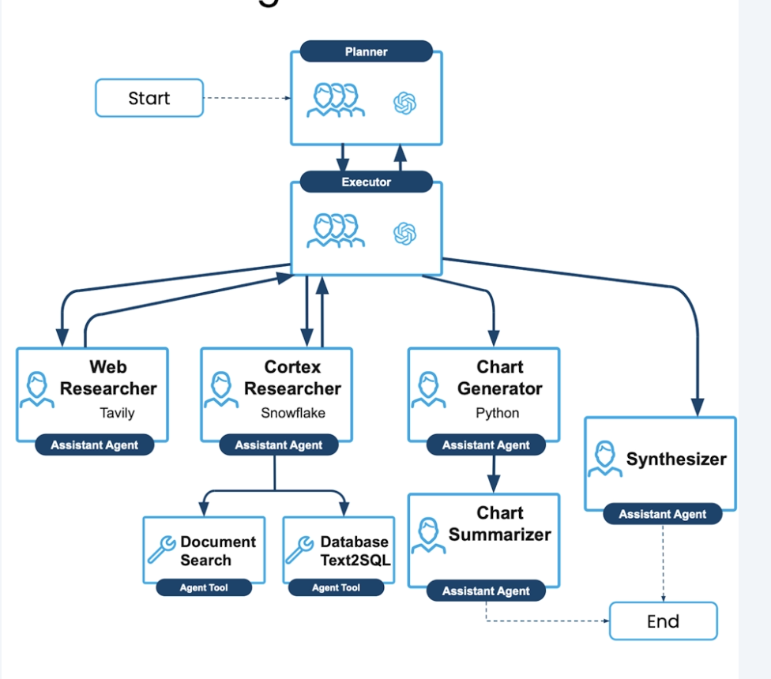
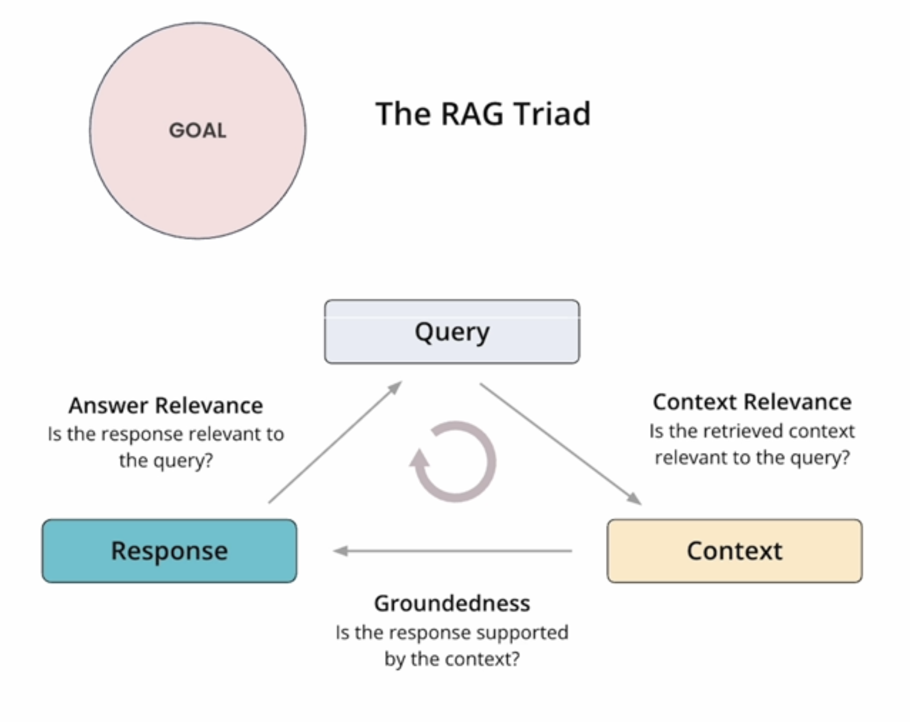

# data_agent
This is a multi-agent system that can perform web research, answer questions and generate charts, integrated with Snowflake Cortex Agents for grounded data and private data access.

## Environment
LangChain: Planner, Executor, Web Researcher, Chart Generator, Chart Summarizer, Synthesizer      
Snowflake: Provide grounded data for the cortex researcher       
Trulens: an open-source library designed for evaluating and tracking LLM applications, particularly those built with RAG and agentic workflows.         

``` bash
# install dependencies
pip install -r requirements.txt
```

## Multi-Agent System

### Architecture


### Prompt
In this project, to get the best output from OpenAI API, the prompts distinct a system prompt and a user prompt.
**System prompt**
System prompt establishes the model's role, instructing it to act as a helpful assitant for story telling. 

**User prompt**
User prompt then sets up the beginning of a story, in our case, they are planner prompts and execute prompts, which providing an initial context that introduces the task to the agent.

**Key tips for effective and reliable prompts**:
- Communicate clearly and preciselywhen writing prompts. The ability to clearly state tasks and describe concepts is crucial.
- Be  willing  to  iterate  rapidly,  sending  many  prompts  to  the  model  in  quick  succession.  Good  prompt engineers are comfortable with constant back-and-forth refinement.
- Consider edge casesand unusual scenarios when designing prompts. Think about how your prompt might fail in a typical situations.
- Test  your  prompts  with  imperfect,  realistic  user  inputs.  Don’t  assume  users  will  provide  perfectly formatted or grammatically correct queries.
- Read  and  analyze  model  outputs  carefully. Pay  close  attention  to  whether  the  model  is  following instructions as intended.
- Strip  away  assumptions  and  clearly  communicate  the  full  set  of  information  needed  for  a  task. Break down the tasksystematically to ensure all necessary details are included.
- Think about the “theory of mind”of the model when writing prompts. Consider how the model might interpret your instructionsdifferently than intended.
- Use version control and track experimentswhen working with prompts. Treat prompts like codein terms of management and iteration.
- Ask  the  modelto  identify  unclear  parts  or  ambiguities  in  your  instructions.  This  can  help  refine  and improve your prompts.
- Be precise without overcomplicating. Aim for clear  task descriptions without building unnecessary abstractions.
- Consider the balance between typical cases and edge cases. While handling edge cases is important, don’t neglect the primary use case.
- Think about how prompts integrate into larger systems. Consider factors like data sources, latency, and overall system design.
- Don’t rely solely on writing skills; prompt engineering requires a mix of clear communication and systematic thinking. Good writers aren’t necessarily good prompt engineers, and vice versa.
- When working with customers, help them understand the realities of user input. Guide them to considerreal-world usage patternsrather than idealized scenarios.
- Practice  looking  at  data  and  model  outputs  extensively.  Familiarize  yourself  with  how  the  model responds to different types of prompts and inputs.


### Components
- Planner
- Executor
- Web Researcher
- Cortex Researcher
- Chart Generator
- Chart Summarizer
- Synthesizer

## Add Cortex Researcher
### Architecture


### New Components
- Cortex Researcher

## Observe Agent Perforrmance
Because the data agents at their core are performing research and generation tasks, we can apply the RAG Triad to assess the data agent's goal completion.

### RAG Triad
- Answer Relevance
- Context Relevance
- Groundedness feedback: It measures if an AI's answer is supported by the source information it was given.


### OpenTelemetry traces and evaluations
 

## Measure Agent's GPA
Agents are most effective when acting in alignment with a high-quality plan. For that reason, we can identify common failure modes stemming from misalignment between the goal, the plan and the agent's actions. Then through careful criteria and a strong LLM judge, we can develop evaluators to detect these common agent failure modes and assess separable dimensions of agent quality.


